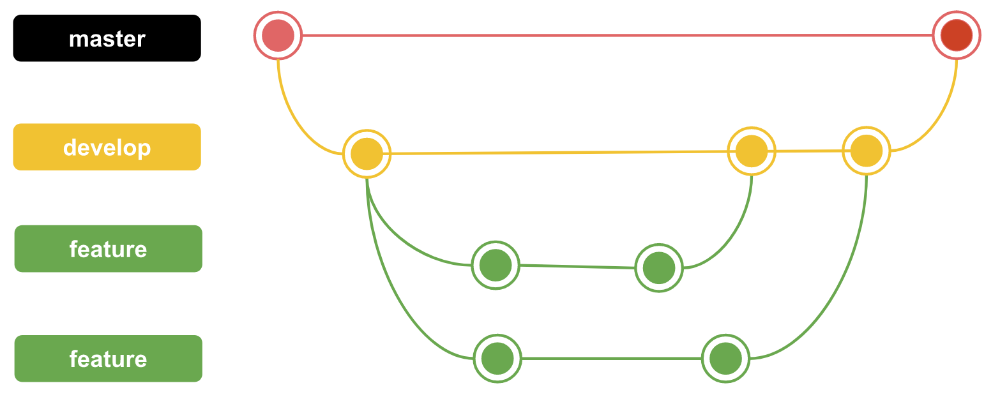

# Session 2 - Versioning Control with Git

Rangkuman ini berisi:
1. Versioning / Version Control
2. Git
3. Mengoptimalkan Kolaborasi Development

## Versioning / Version Control

→ sebuah sistem yang merekam perubahan-perubahan dari waktu ke waktu sehingga kita dapat melihat kembali versi tertentu suatu saat nanti.

Nantinya bertugas untuk mencatat versi yang dikerjakan oleh orang ataupun sebuah kelompok. Hal ini baik dalam mengerjalan proyek secara berkelompok ataupun perorangan.

> **Revision is a must** | don’t expect every code is perfect

## Git
→ salah satu version control system populer yang digunakan para developer untuk mengembangkan software secara bersama-sama. Git dapat melacak perubahan yang diberikan, kemudian juga dapat kembali ke beberapa poin (versi) sebelumnya.

“Commit” → catatan perubahan
GitHub → Git hosting service

### Some command(s) to note:

| commands                    |                            description                                    |
|:----------------------------|:--------------------------------------------------------------------------|
| git add <file>              | menambahkan file ke staging area                                          |
| git commit -m "commit_name" | commit file ke repository                                                 |
| git push origin main        | push file ke server, main = nama branch                                   |
| git pull origin main        | pull file dari server, main = nama branch                                 |
| git log --oneline           | melihat perubahan apa saja yang telah dilakukan                           |
| git branch --list           | memperlihatkan seluruh branch                                             |
| git branch <branch>         | membuat branch baru <branch>                                              |
| git branch -D <branch>      | menghapus paksa <branch>                                                  |
| git branch -a               | daftar branch remote                                                      |

## Mengoptimalkan Kolaborasi Development
-------------------------------------

→ perlu dibuat beberapa branch agar kolaborasi dapat berjalan dengan optimal.

1.  Buat branch master dari branch development

    $ (master) git branch development
    $ (master) git checkout development

2.  Hindari direct edit ke branch development

    $ (development) git branch feature1
    $ (development) git branch feature2

3.  Merge branch feature hanya ke branch development

    $ (feature1) git checkout development
    $ (development) git merge feature1

4.  Merge branch development ke branch master jika project selesai

    $ (master) git merge development

> **The Best Way of Learning about Anything is by Doing**

## Tugas  
    Tugas GitHub:   
    1.  Buat Repository baru 
    2.  Masukkan Project dan buat project tersebut sebagai master
    3.  Buat branch baru yang berfungsi sebagai develop 
    4.  Buat branch ketiga sebagai penambahan fitur. Pada branch ini, lakukan penambahan fitur, kemudian jika selesai, merge branch ketiga kedalam branch develop.  
    5.  Buatlah branch keempat sebagai penambahan fitur, sama seperti branch ketiga.  
    6.  Buktikan dengan screenshot dari insigts→network. Kumpulkan screenshot dan juga link repository
    
### Hasil Pengerjaan

