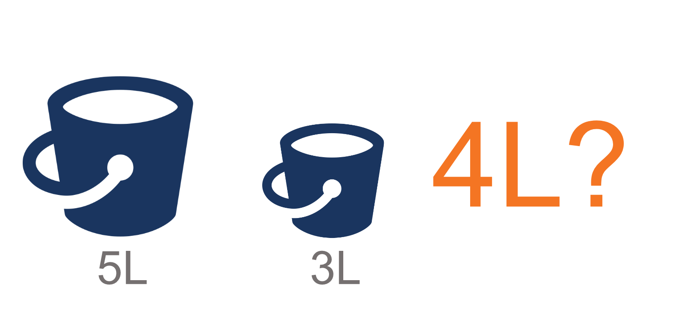

# Session 3 - Software Testing as A Carreer Path

Rangkuman ini berisi:
1. Apa itu Software Testing?
2. Skill yang Harus Dikuasi Software Tester
3. Apa Saja yang Harus Dilakukan Software Tester?
4. Tahapan Karir Software Tester
5. Praktikum

## Apa itu Software Testing?
→ software testing merupakan proses pengecekan sistem ataupun program agar kita dapat menentukan apakah program tersebut sudah sesuai dengan target dan yang diinginkan. Sebagai hasilnya, tester akan sering menemukan atau mengidentifikasi adanya bug pada program.

## Skill yang Harus Dikuasi Software Tester
### Non-Technical Skill:
1.  Analitical Skill → memecah tatanan software yang kompleks menjadi unit yang lebih sederhana
2.  Communication Skill → hal yang sangat penting untuk berkomunikasi langsung ke tim, juga memberikan kritik tanpa menyinggung tim developer
3.  Time Management & Organization Skill → dapat memahami apa yang harus dapat dikerjakan segera atau setelahnya. Mengerjakan pekerjaan kita tepat waktu juga merupakan hal yang penting
4.  Great Attitude → sebuah kebiasaan pola pikir ‘test to break’, detail orientation, dan kemauan untuk belajar
5.  Passion → harus memiliki passion di bidang software testing

### Technical Skill

1.  Basic Unix/Linux Commands → diperlukan untuk melakukan automation atau software testing
2.  Test Management Tools → digunakan untuk menyimpan informasi bagaimana pengujian produk dilakukan.
3.  Tracking Management Tools → digunakan untuk mengolah software agar berjalan secara efisien
4.  Automation Testing Tools → pemilihan ini mempengaruhi kesuksesan software testing

## Apa Saja yang Harus Dilakukan Software Tester?

1.  Memahami kebutuhan dokumen untuk pembuatan sistem atau fitur
2.  Membuat Test Case
3.  Menjalankan Test Case yang dibuat
4.  Melakukan Reporting jika terdapat bu
5.  Mengikuti meeting bersama stakeholder yang lainnya

## Tahapan Karir Software Tester
1.  Junior Quality Engineer (Fresher)
2.  Quality Engineer (1-2 years experience)
3.  Senior Quality Engineer (>3 years experience)
4.  Quality Engineer Lead (5-6 years experience)
5.  Quality Engineer Manager (8-11 years experience)

## Praktikum

Pengguna diberikan ember 5L dan 3L. 
Identifikasi masalah: bagaimana pengguna bisa mendapatkan 4L?
Step yang harus diikuti:
1.  Isi penuh ember 3L, tuang ke ember 5L hingga habis
2.  Isi penuh ember 3L, tuang ke ember 5L hingga ember 5L penuh dan tersisa 1L di ember 3L
3.  Buang semua isi ember 5L, pindahkan 1L di ember 3L ke ember 5L
4.  Isi penuh ember 3L, tuang ke ember 5L
5.  Sekarang terdapat 4L dalam ember 5L