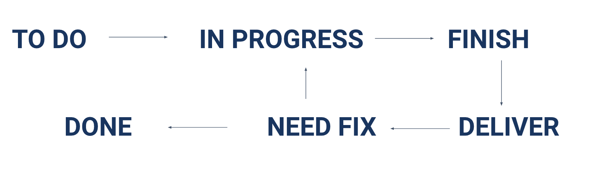

# Session 6 - Tracking Management Tools

Rangkuman ini berisi:
1. Apa itu JIRA?
2. Panel Fase pada JIRA
3. Issue Type pada JIRA
4. Praktikum (Theory)

## Apa itu JIRA?
→ dikembangkan oleh Atlassian yang digunakan untuk Bug Tracking, Issue Tracking, hingga Project Management. Fitur unggulan JIRA:
1.  Test Assignment → dilengkapi dengan UI workflow yang dijalankan.
2.  Scrum & Combound → fitur yang membedakan dengan aplikasi tracking management tools lainnya.
3.  Roadmaps → agar anggota bisa lebih fokus dengan apa yang dikerjakan.

## Panel Fase pada JIRA

1. TO DO → berisi story yang akan dikerjakan dan telah diprioritaskan saat planning. Story yang ditempatkan paling atas menandakan story tersebut merupakan prioritas utama.
2. IN PROGRESS → berisi story atau yang sedang dikerjakan oleh software engineer/developer.
3. FINISH → berisi story yang telah selesai dikerjakan oleh software engineer/developer, namun belum siap untuk tahap testing.
4. DELIVER → berisi story yang siap memasuki tahap testing oleh Quality Engineer.
5. TESTING → berisi story yang sedang di testing oleh Quality Engineer.
6. NEED FIX → berisi hasil proses testing yang tidak lolos kriteria oleh tim development.
7. DONE → berisi hasil proses testing yang telah lolos kriteria oleh tim development.

## Issue Type pada JIRA
1. Story → jenis issue yang biasa digunakan untuk membuat fitur baru
2. Task → jenis issue yang biasa digunakan untuk membuat perincian tugas tugas yang akan dikerjakan
3. Bug → jenis issue yang biasa digunakan jika terjadi penemuan bug saat proses testing oleh software tester
4. Epic → jenis issue untuk melakukan pengelompokan task

## Praktikum (Theory)
1. Apa yang dimaksud dengan Bugs? 
→ Bugs adalah suatu cacat desain yang mengakibatkan terjadinya galat pada peralatan atau program sehingga tidak berfungsi sebagaimana mestinya, umumnya ditemukan pada perangkat lunak
2. Apa yang dimaksud dengan "TO DO" pada JIRA? 
→ "TO DO" adalah sebuah panel berisi story yang akan dikerjakan dan telah diprioritaskan saat planning. Story yang ditempatkan paling atas menandakan story tersebut merupakan prioritas utama.
3. Apa yang dimaksud dengan "IN PROGRESS" pada JIRA?
→ "IN PROGRESS" adalah sebuah panel yang berisi story atau yang sedang dikerjakan oleh software engineer/developer.
4. Apa perbedaan antara "DELIVER" dan "FINISH"?
→ "DELIVER" adalah sebuah panel yang berisi story yang siap memasuki tahap testing oleh Quality Engineer, sedangkan "FINISH" adalah sebuah panel yang berisi story yang telah selesai dikerjakan oleh software engineer/developer, namun belum siap untuk tahap testing.
5. Apa yang dimaksud dengan "EPIC" pada JIRA?
→ "EPIC" adalah jenis issue untuk melakukan pengelompokan task.
6. Apa yang harus dilakukan saat menggunakan tools JIRA, jika kita menemukan bugs pada fitur yang sudah dilakukan testing?
→ Membuat issue baru dengan tipe "BUG" untuk diperiksa oleh software tester pada sprint berikutnya.