# Session 9 - Basic Linux Command

# Praktikum

## Basic Commands
### cal
perintah untuk memperlihatkan kalendar

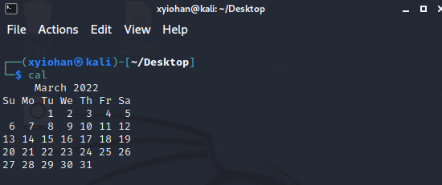

### date
perintah untuk memperlihatkan tanggal

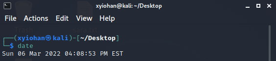

## File System Commands

### touch
perintah untuk membuat sebuah file kosong di direktori saat ini

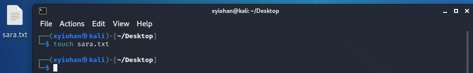

### cat
singkatan dari concatenate, perintah ini digunakan untuk memperlihatkan list dokumen yang dipilih

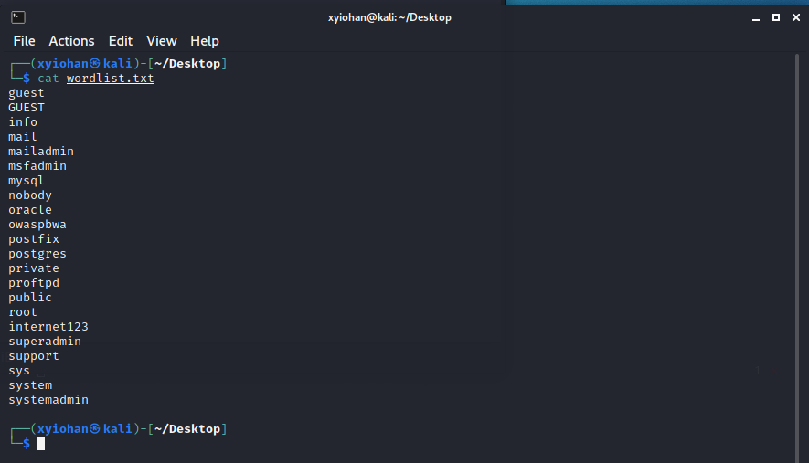

### cp
perintah untuk menyalin (copy) sebuah file

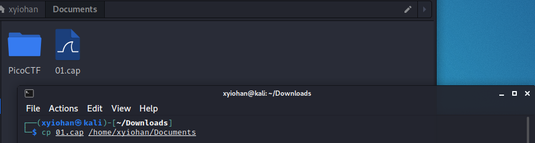

### mv
perintah untuk memindahkan sebuah file

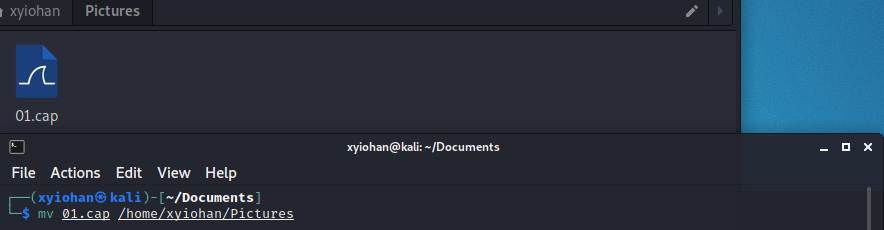

### rm
perintah untuk menghapus sebuah file

### mkdir
perintah untuk membuat sebuah folder

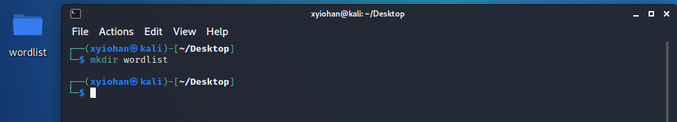

### rmdir
perintah untuk menghapus sebuah folder, pada kali ini folder harus tidak ada isi atau kosong

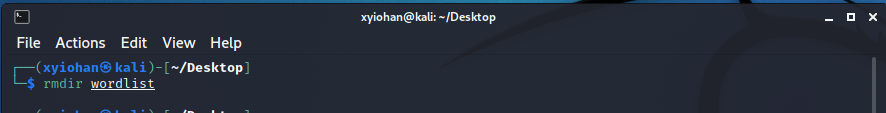

### cd
perintah untuk berpindah direktori

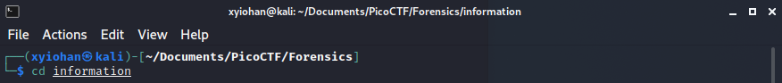

### pwd
perintah untuk mengetahui posisi direktori user saat ini

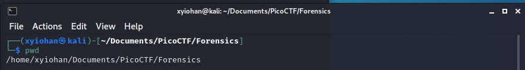

## Process Control Commands

### top
singkatan dari table of process, menampilkan aktivitas prosesor dari Linux yang sedang digunakan.

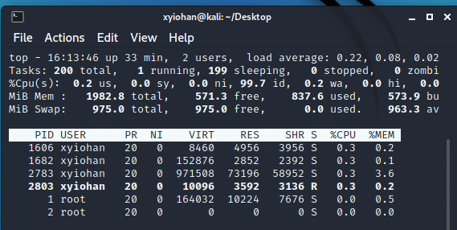

### clear
perintah untuk membersihkan window command line.

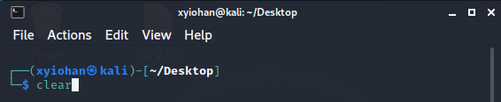

### history
perintah untuk menampilkan perintah apa saja yang telah diketikkan sebelumya pada CLI

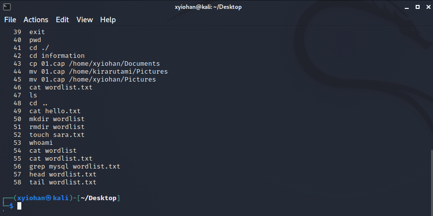

## Utilities Program Command

### ls
perintah untuk menampilkan konten yang tersedia pada direktori saat ini

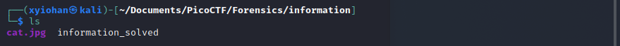

### which
perintah yang digunakan untuk mencari perintah yang dapat dieksekusi di direktori yang ditentukan oleh variabel environment

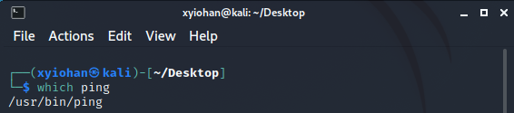

### sudo
perintah untuk menjalankan perintah dengan status super user, contohnya sudo su untuk masuk sebagai root

### find
perintah untuk mencari file 

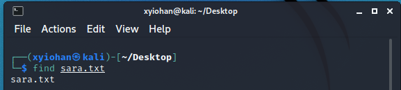

## File Access Permission

### chmod
perintah untuk mengubah permission file atau folder yang dipilih

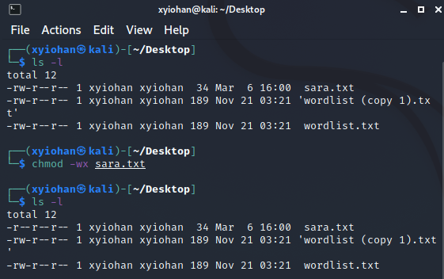