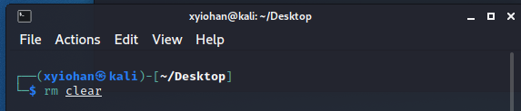
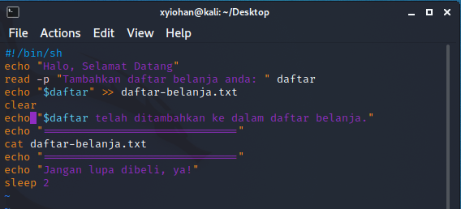

# Session 9 - Basic Linux Command

Rangkuman ini berisi:
1. Definisi Linux Command
2. Kelebihan Command Linux
3. Shell Script
4. Praktikum

# Definisi Linux Command

→ sebuah utilitas dari sistem operasi linux, semua tugas dasar dan lanjutan dapat dilakukan dengan melakukan commands. Commands dijalankan di terminal Linux.

# Kelebihan Command Linux

1. Less Resource: CLI ringan digunakan sehingga tidak merharuskan komputer untuk memiliki spesifikasi tinggi
2. Repetitive Task Friendly: dapat menyimpan script untuk mengotomatiskan tugas yang sama berulang kali
3. Powerful: terlihat lebih stabil dibandingkan GUI karena hanya menggunakan teks

# Shell Script
→ sebuah bahasa pemrograman yang disusun berdasarkan shell commands. Shelll merupakan program yang berfungsi sebagai jembatan antara user dan kernel.

# Praktikum

# Commands pada Linux
===
## Basic Commands

### cal
perintah untuk memperlihatkan kalendar

### date
perintah untuk memperlihatkan tanggal

## File System Commands

### touch
perintah untuk membuat sebuah file kosong di direktori saat ini

### cat
singkatan dari concatenate, perintah ini digunakan untuk memperlihatkan list dokumen yang dipilih

### cp
perintah untuk menyalin (copy) sebuah file

### mv
perintah untuk memindahkan sebuah file

### rm
perintah untuk menghapus sebuah file

### mkdir
perintah untuk membuat sebuah folder

### rmdir
perintah untuk menghapus sebuah folder, pada kali ini folder harus tidak ada isi atau kosong

### cd
perintah untuk berpindah direktori

### pwd
perintah untuk mengetahui posisi direktori user saat ini

## Process Control Commands

### top
singkatan dari table of process, menampilkan aktivitas prosesor dari Linux yang sedang digunakan.

### clear
perintah untuk membersihkan window command line.

### history
perintah untuk menampilkan perintah apa saja yang telah diketikkan sebelumya pada CLI

## Utilities Program Command

### ls
perintah untuk menampilkan konten yang tersedia pada direktori saat ini

### which
perintah yang digunakan untuk mencari perintah yang dapat dieksekusi di direktori yang ditentukan oleh variabel environment

### sudo
perintah untuk menjalankan perintah dengan status super user, contohnya sudo su untuk masuk sebagai root

### find
perintah untuk mencari file 

## File Access Permission

### chmod
perintah untuk mengubah permission file atau folder yang dipilih

===
# Shell Script
===
Kali ini saya membuat Shell Script seperti di bawah ini.

### echo "Halo, Selamat Datang"
program akan menuliskan teks "Halo, Selamat Datang" begitu pula dengan perintah echo lainnya

### read -p "Tambahkan daftar belanja anda: " daftar
program akan membaca input oleh user dan disimpan dalam variabel %daftar

### echo "$daftar" >> daftar-belanja.txt
program akan menambahkan variabel $daftar ke dalam daftar-belanja.txt.

### clear
program akan membersihkan window command line.

### cat daftar-belanja.txt
program akan menampilkan isi dari daftar-belanja.txt

### sleep
program akan delay selama 2 detik

## Hasil Program

Berikut hasil running dari program sheel script yang telah dituliskan sebelumnya.

