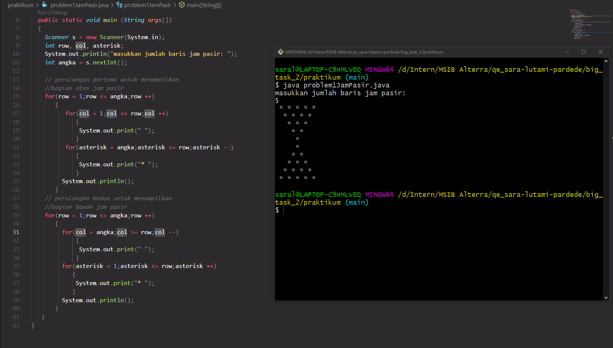
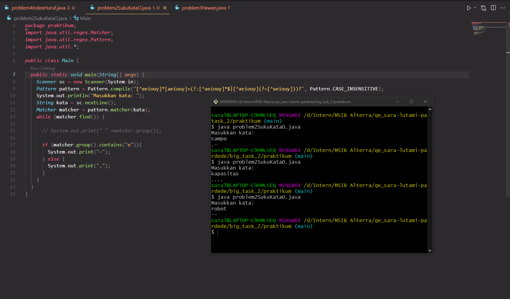
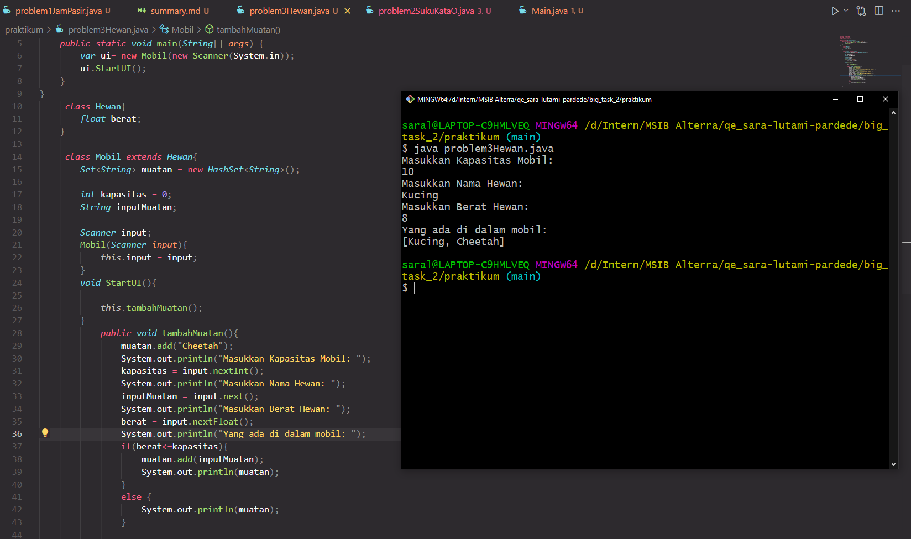
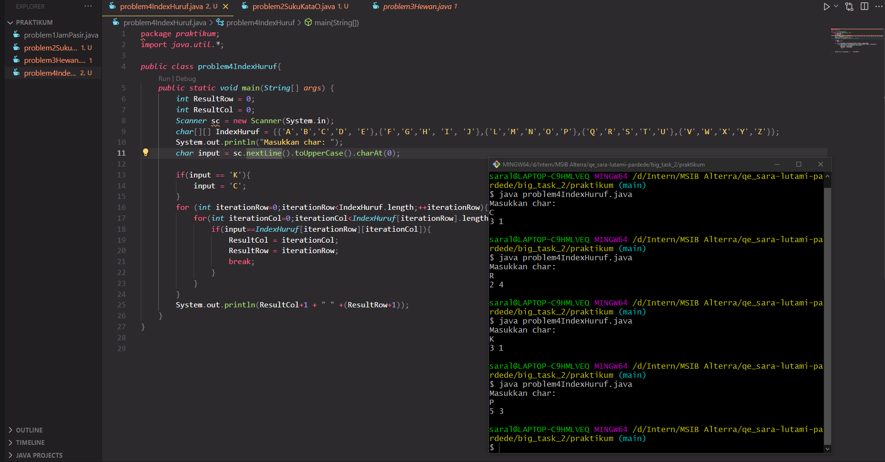

# Summary Big Task 2

## Problem 1 - Jam Pasir
Diberikan studi kasus untuk menampilkan bentuk Jam Pasir dengan menggunakan asterisk (*)
1. Buat dua perulangan
2. Perulangan pertama untuk menampilkan segitiga atas, ada 2 for didalamnya
    For pertama untuk menampilkan spasi di tiap row
    Lalu For kedua akan menampilkan * tiap akhir row
3. Perulangan kedua untuk menampilkan segitiga bawah, ada 2 for di dalamnya
    For pertama untuk menampilkan spasi di tiap row
    Lalu For kedua akan menampilkan * tiap akhir row
4. Di fungsi main akan memanggil berapa banyak bintang yang akan ditampilkan.
5. Jika program dijalankan, program akan menampilkan seperti di bawah ini:



## Problem 2 - Suku Kata O
Diberikan studi kasus untuk input sebuah kata dan dipisah berdasarkan suku kata. Jika suku kata terdapat huruf 'o', output akan berubah menjadi '-', selainnya akan berubah menjadi '.'.
1. Cari rumus suku kata, kali ini saya menemukan rumus berikut
``` [^aeiouy]*[aeiouy]+(?:[^aeiouy]*$|[^aeiouy](?=[^aeiouy]))?```
2. Cari tahu mengenai regex, dan pakai fungsinya di code (matcher, pattern)
3. Buat program untuk read input pemain
4. buat fungsi percabangan jika terdapat o atau tidak
5. Lihat hasil di bawah ini:


## Problem 3 - Muatan OOP
Diberikan studi kasus untuk membuat class Hewan yang memiliki property berat, serta class Mobil yang memiliki properti kapasitas, muatan, serta method tambahMuatan.
1. Buat class Hewan dan Mobil terlebih dahulu
2. Isi class Hewan dengan properti berat bertipe float
3. Isi class Mobil dengan properti kapasitas bertipe integer, inputMuatan bertipe string
4. Buat method tambahMuatan di dalam class Mobil. Di dalam method ini akan terjadi pembacaan data kapasitas, nama hewan, serta berat yang nantinya akan disimpan dalam array.
5. Masukkan fungsi set
```> Set<String> muatan = new HashSet<String>();```
agar bisa menambahkan string menggunakan fungsi add
6. Nantinya, string yang ditambahkan melalui input user akan ditampilkan seperti di bawah ini.


## Problem 4 - Index Huruf
Diberikan studi kasus untuk mencari posisi huruf di dalam sebuah tabel.
1. Buat array matrix sesuai urutan seperti di soal.
2. Masukkan program untuk membaca input user, kali ini memakai Char karena hanya satu karakter
3. Masukkan perulangan untuk mencari posisi char yang diinput oleh user
4. tampilkan char setelah ditemukan. Dapat dilihat seperti di bawah ini.


